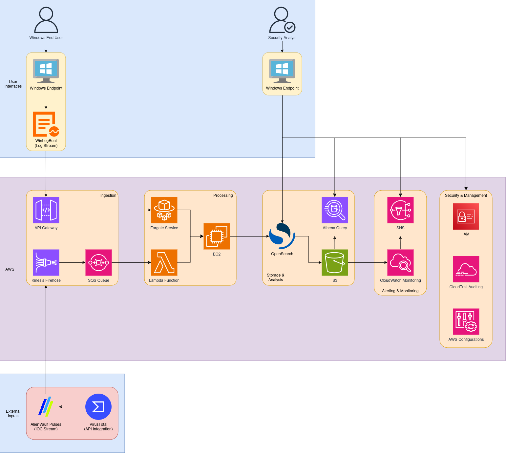

# MySIEM: 1-Click Deploy Cloud-Native SIEM on AWS

This repository contains a CloudFormation template and supporting code for a **cloud-native SIEM solution** built on AWS. This solution demonstrates how to ingest Windows logs and threat intelligence data, correlate events, and trigger alerts—all using AWS native services and free, open-source tools. This tool is easy to deploy, open source, and cloud-native, making it more accessible to use.

> **Note:** This is a demo/proof-of-concept deployment. It uses a public OpenSearch domain (with an IP-based access policy) rather than a secure VPC-based deployment and does not yet include advanced authentication (e.g., Cognito or fine-grained access control). In production, you should tighten network security, use restricted IP ranges, and enable authentication. This project is a work-in-progress, so the goal is to eventually have a production grade SIEM, free to use by anyone.

## Table of Contents

- [Overview](#overview)
- [Architecture Diagram](#architecture-diagram)
- [Components](#components)
- [Deployment Instructions](#deployment-instructions)
- [Configuration](#configuration)
- [Usage](#usage)
- [Next Steps](#next-steps)
- [License](#license)

## Overview

This solution is composed of the following main components:

- **Data Ingestion:**

  - **Windows Logs:** Forwarded by [Winlogbeat](https://www.elastic.co/beats/winlogbeat), a free and open-source log shipper installed on Windows devices.
  - **IOC Data:** Ingested from AlienVault OTX via a Lambda function that runs every hour.
- **Data Storage & Processing:**

  - **Amazon OpenSearch Service:** Stores logs and IOC data. A public OpenSearch domain is created with an IP-based access policy.
  - **Kinesis Firehose:** Ingests logs from Winlogbeat and sends them to OpenSearch while also backing them up to an S3 bucket.
  - **S3 Bucket:** Archives logs. A lifecycle rule transitions objects to a lower-cost storage class (STANDARD_IA) after 30 days.
  - **Lambda Functions:**
    - One Lambda fetches and indexes IOC data from AlienVault.
    - A second Lambda runs correlation analysis every 5 minutes to detect suspicious activity and publishes alerts via SNS.
- **Alerting & Visualization:**

  - **SNS Topic:** Used to deliver alerts when suspicious log entries are detected.
  - **OpenSearch Dashboards:** Provides a UI where you can import a pre-built SIEM dashboard and visualize log data and alerts.

## Architecture Diagram

A high-level system design diagram for this application:




## Deployment Instructions

1. **Clone the Repository**

   ```bash
   git clone https://github.com/susapr/MySiem.git
   cd MySiem
   ```
2. **Deploy the CloudFormation Stack**

   - Open the [AWS CloudFormation Console](https://console.aws.amazon.com/cloudformation/home).
   - Choose **Create stack** → **With new resources (standard)**.
   - Upload the `template.yaml` file.
   - Provide a stack name (e.g., `CloudNativeSIEM`).
   - Set the parameters:
     - **AllowedIPRange:** (For demo purposes, restrict to your IP, e.g., `198.51.100.10/32`).
       - To find your ip address, you can run `ipconfig /all` on command prompt. It will be listed under the network adapter you are using (ex: `eth0`)
     - **AlienVaultAPIKey:** Enter your AlienVault OTX API key.
   - Follow the prompts to create the stack.
3. **Monitor the Stack Creation**

   - The stack may take 10–15 minutes to create.
   - Once complete, view the **Outputs** tab to get the following:
     - **OpenSearchDomainEndpoint**
     - **OpenSearchDashboardsURL**
     - **FirehoseStreamName**
     - **SIEMAlertsTopicARN**
4. **Set Up Winlogbeat**

   - Install [Winlogbeat](https://www.elastic.co/beats/winlogbeat) on your Windows devices.
   - Configure Winlogbeat to forward logs in JSON format via HTTP to the Kinesis Firehose stream named **SIEMLogStream**.

## Usage

- **View the SIEM Dashboard:**
  Open the URL provided in the CloudFormation Outputs (e.g., `https://<domain>/_dashboards`) in your browser and import your saved SIEM dashboard.
- **Monitor Alerts:**
  Alerts generated by the correlation function will be published to the SNS topic. You can subscribe an email address or another endpoint to receive these alerts.

## Next Steps

This solution is a starting point. Future improvements and next steps include:

- **Network Security Enhancements:**

  - Migrate the OpenSearch domain into a VPC.
  - Use restricted IP ranges or enable Fine-Grained Access Control with Cognito for secure access.
- **Data Processing Enhancements:**

  - Refine log parsing and enrichment with Winlogbeat modules.
  - Integrate additional threat intelligence feeds for richer IOC data.
- **Advanced Correlation:**

  - Improve the correlation logic to handle more complex relationships between logs and IOC data.
  - Consider integrating machine learning for anomaly detection.
- **Operational Monitoring:**

  - Add CloudWatch alarms and dashboards to monitor the health and performance of the SIEM components.
  - Implement index lifecycle management (ILM) for OpenSearch.
- **Packaging and Distribution:**

  - Package the solution as an AWS Quick Start or consider publishing it on AWS Marketplace for broader adoption.

## License

This project is licensed under the MIT License. See the [LICENSE](LICENSE) file for details.

---

Happy building, and stay secure!
